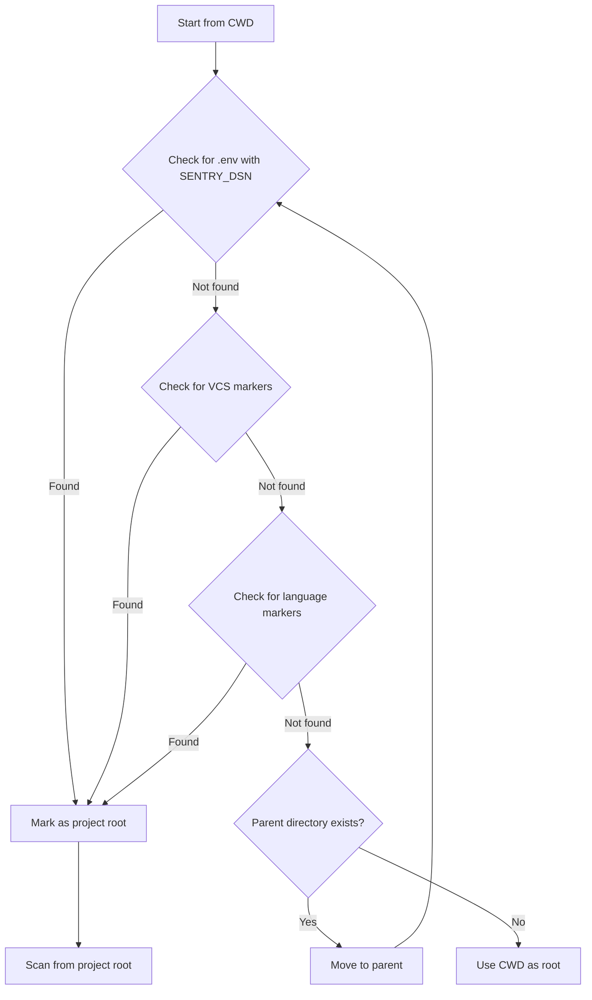

Sentry CLI can automatically detect your project's DSN by scanning source code, environment files, and environment variables. This enables zero-configuration workflows where the CLI infers the target project from your codebase.

## Detection Priority

DSNs are detected in priority order (highest to lowest):

1. **Source code** - Explicit DSN in `Sentry.init()` calls
2. **Environment files** - `.env`, `.env.local`, `.env.production`, etc.
3. **Environment variable** - `SENTRY_DSN`

<Info>
Higher-priority sources override lower-priority ones. For example, a DSN in source code takes precedence over `.env` files.
</Info>

## Source Code Detection

The CLI scans source files for DSN patterns in `Sentry.init()` calls:

### Supported Languages

**JavaScript/TypeScript:**
```javascript
Sentry.init({
  dsn: "https://abc123@o123.ingest.sentry.io/456"
});
```

**Python:**
```python
sentry_sdk.init(
    dsn="https://abc123@o123.ingest.sentry.io/456"
)
```

**Go:**
```go
sentry.Init(sentry.ClientOptions{
    Dsn: "https://abc123@o123.ingest.sentry.io/456",
})
```

**Java:**
```java
SentryOptions options = new SentryOptions();
options.setDsn("https://abc123@o123.ingest.sentry.io/456");
```

**Ruby:**
```ruby
Sentry.init do |config|
  config.dsn = 'https://abc123@o123.ingest.sentry.io/456'
end
```

**PHP:**
```php
Sentry\init(['dsn' => 'https://abc123@o123.ingest.sentry.io/456']);
```

### Detection Algorithm

The code scanner uses language-specific patterns:

```typescript
// From src/lib/dsn/code-scanner.ts
export async function scanCodeForFirstDsn(
  cwd: string
): Promise<DetectedDsn | null> {
  for (const detector of languageDetectors) {
    const pattern = `**/*${detector.extensions.join(',')}`;
    const glob = new Bun.Glob(pattern);
    
    for await (const file of glob.scan({ cwd })) {
      // Skip node_modules, vendor, etc.
      if (shouldSkipPath(file, detector.skipDirs)) {
        continue;
      }
      
      const content = await Bun.file(join(cwd, file)).text();
      const dsn = detector.extractDsn(content);
      
      if (dsn && parseDsn(dsn)) {
        return createDetectedDsn(dsn, "code", file);
      }
    }
  }
  return null;
}
```

<Warning>
The scanner skips common directories like `node_modules/`, `vendor/`, `.git/`, `dist/`, and `build/` to avoid false positives and improve performance.
</Warning>

## Environment File Detection

The CLI searches for DSN in environment files following the priority order:

1. `.env.local`
2. `.env.development.local`
3. `.env.production.local`  
4. `.env.test.local`
5. `.env`
6. `.env.development`
7. `.env.production`
8. `.env.test`

### Environment File Format

DSN can be specified in various formats:

```bash
# Standard format
SENTRY_DSN="https://abc123@o123.ingest.sentry.io/456"

# Without quotes
SENTRY_DSN=https://abc123@o123.ingest.sentry.io/456

# Single quotes
SENTRY_DSN='https://abc123@o123.ingest.sentry.io/456'

# With export keyword
export SENTRY_DSN="https://abc123@o123.ingest.sentry.io/456"
```

### Parsing Logic

The environment file parser handles various formats:

```typescript
// From src/lib/dsn/env-file.ts
export function extractDsnFromEnvContent(content: string): string | null {
  const lines = content.split('\n');
  
  for (const line of lines) {
    const trimmed = line.trim();
    
    // Skip comments and empty lines
    if (!trimmed || trimmed.startsWith('#')) {
      continue;
    }
    
    // Match SENTRY_DSN=value pattern
    const match = /^export\s+SENTRY_DSN\s*=\s*['"]?([^'"\s]+)['"]?/i.exec(trimmed)
               || /^SENTRY_DSN\s*=\s*['"]?([^'"\s]+)['"]?/i.exec(trimmed);
    
    if (match?.[1]) {
      return match[1];
    }
  }
  
  return null;
}
```

## Environment Variable Detection

As a fallback, the CLI checks the `SENTRY_DSN` environment variable:

```bash
export SENTRY_DSN="https://abc123@o123.ingest.sentry.io/456"
sentry issue list
```

This has the lowest priority and is checked only if no DSN is found in code or environment files.

## Project Root Detection

Before scanning for DSNs, the CLI must determine the project root. It walks up from the current directory looking for markers:

### VCS Markers
- `.git/`
- `.hg/`
- `.svn/`

### Language Markers

**JavaScript/Node.js:**
- `package.json`
- `tsconfig.json`
- `jsconfig.json`

**Python:**
- `pyproject.toml`
- `setup.py`
- `setup.cfg`
- `requirements.txt`
- `Pipfile`

**Go:**
- `go.mod`
- `go.sum`

**Java:**
- `pom.xml`
- `build.gradle`
- `build.gradle.kts`

**Ruby:**
- `Gemfile`
- `.ruby-version`

**PHP:**
- `composer.json`

**Rust:**
- `Cargo.toml`

### Detection Flow



Finding a DSN in `.env` during walk-up stops the walk (determines project root) but does NOT short-circuit detection - the CLI still scans for code DSNs which have higher priority.

## Caching Strategy

Detection results are cached in SQLite to avoid repeated scans:

### DSN Cache Schema

```sql
CREATE TABLE dsn_cache (
  project_root TEXT PRIMARY KEY,
  dsn TEXT NOT NULL,
  project_id TEXT,
  org_id TEXT,
  source TEXT NOT NULL,
  source_path TEXT,
  fingerprint TEXT,
  updated_at INTEGER NOT NULL
);
```

### Cache Validation

Cached entries are validated before use:

```typescript
// From src/lib/dsn/detector.ts
async function verifyCachedDsn(
  cwd: string,
  cached: CachedDsnEntry
): Promise<DetectedDsn | null> {
  // For env var source, check if DSN still matches
  if (cached.source === "env") {
    const envDsn = detectFromEnv();
    if (envDsn?.raw === cached.dsn) {
      return envDsn; // Cache valid
    }
    return envDsn; // DSN changed or removed
  }
  
  // For file-based sources, re-read the file
  if (cached.sourcePath) {
    const content = await Bun.file(cached.sourcePath).text();
    const foundDsn = extractDsnFromContent(content, cached.source);
    
    if (foundDsn === cached.dsn) {
      return createDetectedDsn(cached.dsn, cached.source, cached.sourcePath);
    }
  }
  
  return null; // Cache invalid
}
```

<Note>
Cache entries are invalidated when the source file changes or the DSN value differs.
</Note>

## Monorepo Support

The CLI detects multiple DSNs in monorepo structures:

```
my-monorepo/
├── apps/
│   ├── frontend/
│   │   └── .env (DSN 1)
│   └── backend/
│       └── .env (DSN 2)
└── packages/
    └── shared/
        └── .env (DSN 3)
```

Use `detectAllDsns()` to find all DSNs:

```typescript
// From src/lib/dsn/detector.ts
export async function detectAllDsns(
  cwd: string
): Promise<DsnDetectionResult> {
  const allDsns: DetectedDsn[] = [];
  
  // 1. Scan all code files
  const { dsns: codeDsns } = await scanCodeForDsns(projectRoot);
  for (const dsn of codeDsns) {
    addDsn(dsn);
  }
  
  // 2. Scan all .env files (including monorepo packages)
  const { dsns: envFileDsns } = await detectFromAllEnvFiles(projectRoot);
  for (const dsn of envFileDsns) {
    addDsn(dsn);
  }
  
  // 3. Check env var
  const envDsn = detectFromEnv();
  if (envDsn) {
    addDsn(envDsn);
  }
  
  return {
    primary: allDsns[0] ?? null,
    all: allDsns,
    hasMultiple: allDsns.length > 1,
    fingerprint: createDsnFingerprint(allDsns)
  };
}
```

Each detected DSN includes its `packagePath` (e.g., `apps/frontend`) to track which package it belongs to.

## DSN Format

Detected DSNs are parsed into components:

```typescript
type DetectedDsn = {
  raw: string;              // Full DSN string
  publicKey: string;        // Public key component
  projectId: string;        // Numeric project ID
  orgId?: string;          // Numeric org ID (if present in DSN)
  host: string;            // Sentry host
  source: DsnSource;       // "code" | "env_file" | "env"
  sourcePath?: string;     // Path to source file
  packagePath?: string;    // Monorepo package path
};
```

### DSN Parsing Example

```typescript
const dsn = "https://abc123@o4507034174111744.ingest.us.sentry.io/4507034182500352";

const parsed = parseDsn(dsn);
// {
//   raw: "https://abc123@o4507034174111744.ingest.us.sentry.io/4507034182500352",
//   publicKey: "abc123",
//   orgId: "4507034174111744",
//   projectId: "4507034182500352",
//   host: "o4507034174111744.ingest.us.sentry.io"
// }
```

<Info>
Some DSN formats (especially self-hosted) may not include an org ID in the host. In these cases, the CLI resolves the project using the DSN public key via the `/api/0/projects?query=dsn:<key>` endpoint.
</Info>

## Detection Performance

- **Fast path (cache hit)**: ~5ms - reads single file to verify
- **Slow path (cache miss)**: ~2-5s - full glob scan

The caching strategy ensures subsequent commands are nearly instant even in large monorepos.
